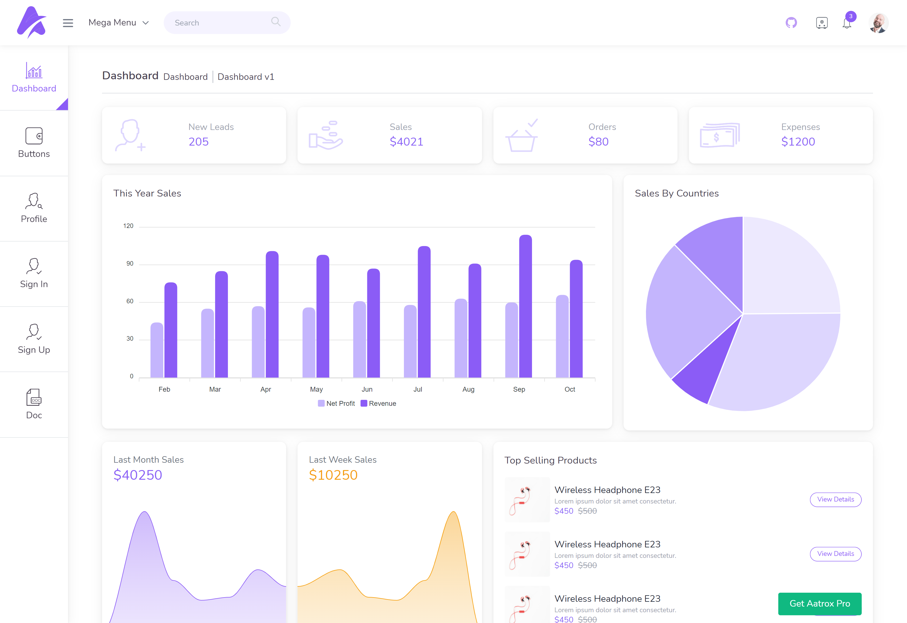

<p align="center">
  
</p>

<h3 align="center">💚 A Minimal Admin Dashboard Develop with Vue 3, Vite, and TailwindCss. It's Free 💥 </h3>

<p align="center">
  Aatrox -  VueJS 3 & TailwindCss Free Admin  Dashboard Template<br>
  <a href="https://aatrox-vue-free.netlify.app"><strong>Explore the Admin dashboard live »</strong></a>
</p>

<p align="center">
<a href="https://aatrox-vue-free.netlify.app">
  
  </a>
</p>

## Tech Stack

**Client Side :** Vue 3 , TailwindCSS , ViteJs

## Aatrox - VueJS 3 & TailwindCss Admin

### Key Features

-   ⚡️ [Vue 3](https://github.com/vuejs/vue-next) & [Vite](https://vitejs.dev)
-   🛣 Beautifully Crafted
-   📦 [TailwindCss](https://tailwindcss.com/)
-   📑 [Nuxt-inspired Routing ](./src/routes/index.js)
-   🔍 Well Organized
-   🌐 Production Ready
-   ♿ Accessible frontend routing
-   🚝 [Ready to Deploy](https://www.netlify.com/)
-   💫 Clean Code

## Aatrox is the most comprehensive admin template available

If you're a developer seeking for a developer-friendly, feature-rich, and highly customizable admin dashboard, Aatrox is the best option. We used industry best practices to create the greatest admin template that is not only quick and easy to use, but also extremely scalable. With maximum convenience and versatility, you'll be able to create any application you desire with no effort.

With ease, create high-quality applications. Create eye-catching, high-quality, and high-performing single-page apps with our creative admin template. Your apps will be fully responsive, ensuring that they look great and work perfectly on desktops, tablets, and mobile devices.

[View Demo](https://aatrox-vue-free.netlify.app)

## Installation ⚒️

> We recommend you use yarn

1. Install all packages

    ```bash
    yarn

    # npm install [for npm]
    ```

2. Run development server

    ```bash
    yarn dev

    # npm run dev [for npm]
    ```

3. Generate build files for deployment

    ```bash
    yarn build

    # npm run build [for npm]
    ```

## Run Locally

Clone the project

```bash
  git clone https://github.com/uilibrary/AatroX-vue
```

Go to the project directory

```bash
  cd AatroX-vue
```

Install dependencies

```bash
  yarn
```

Start the server

```bash
  yarn dev
```

## Upgrade to PRO Version

We also have a pro version of this product which bundles even more pages and components if you want to save more time and design efforts.

| Free Version (this one) | [Aatrox Dashboard PRO](https://aatrox-vue.netlify.app/landingpage) |
| ----------------------- | ------------------------------------------------------------------ |
| **5** Demo Pages        | **50+** demo pages                                                 |
| -                       | ✔ Dark & light mode                                                |
| - 1 Dashboard           | ✔ 5 Dashboard                                                      |
| -                       | ✔ 11 App Pages                                                     |
| -                       | ✔ 6 UiKits Pages                                                   |
| -                       | ✔ Advanced Widgets                                                 |
| -                       | ✔ 2 Profile Version                                                |
| -                       | ✔ 10 Authentication Pages                                          |
| -                       | ✔ 10 Types of Charts Demo Pages                                    |

## Demo

-   [Dashboard Page](https://aatrox-vue-free.netlify.app/dashboards/dashboard-version-one)
-   [Buttons Page](https://aatrox-vue-free.netlify.app/components/button)
-   [Profile Page](https://aatrox-vue-free.netlify.app/profile/profileTwo)
-   [Sign in Page](https://aatrox-vue-free.netlify.app/signIn)
-   [Sign Up Page](https://aatrox-vue-free.netlify.app/signUp)

## Documentation

[Documentation](https://aatorx-vue-doc.vercel.app/)

## 🚀 About Us

We are <a href="https://ui-lib.com/">Ui-Lib</a> , A Team of awesome Developer and desginer trying to make other developer life easy :)

## 🔗 Visit us

[](https://ui-lib.com/)
[](https://www.linkedin.com/company/ui-lib/)
[](https://twitter.com/uilibofficial)

## Roadmap

-   RTL support

-   Lang Support

## Authors

-   [@uilibrary](https://github.com/uilibrary)

## License

[MIT](https://choosealicense.com/licenses/mit/)

## Support

For support, email uilib.help@gmail.com or join our <a href="https://discord.gg/pVW9wdBuYW">discord</a> Server.
